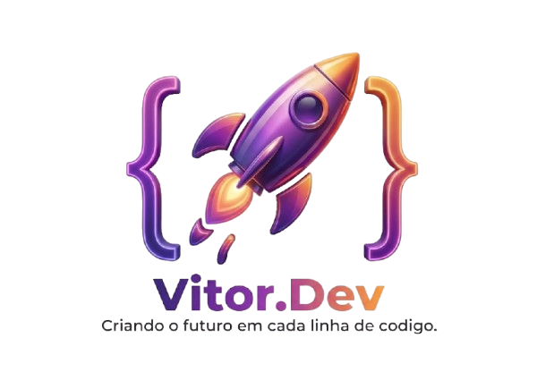

# Portfolio | Vitor.dev

Bem-vindo ao repositório do meu portfólio profissional! Este projeto foi desenvolvido para demonstrar minhas habilidades técnicas como desenvolvedor full-stack, apresentando uma interface moderna, interativa e de alta fidelidade.

## 🔗 Link Direto
Acesse o site online aqui: **[https://vihisantos.github.io/My.Portfolio/](https://vihisantos.github.io/My.Portfolio/)**

📚 **Documentação Online:** Você também pode ler esta documentação formatada diretamente no site em: [https://vihisantos.github.io/My.Portfolio/docs](https://vihisantos.github.io/My.Portfolio/docs)

---

- **🎨 Design Moderno & Premium**: Interface construída com **React 18** e **TailwindCSS**, focada em estética de alta fidelidade e experiência do usuário (UX).
- **🐊 Capybara Holding**: Nova seção institucional integrando projetos de todas as verticais (Commerce, Education, Creative).
- **📺 Mizin Youtube App**: Nova ferramenta desktop para download de vídeos, integrada com modal exclusivo e instruções de uso.
- **💚 Sponsorship System**: Sistema completo de apoiadores com integração de pagamentos e mural da fama dinâmico.
- **🛍️ Portfolio as a Product (SaaP)**: O template do portfólio foi transformado em um produto comercial, pronto para venda e customização.
- **✨ Transições Globais**: Sistema de carregamento fluido com animações personalizadas em todas as trocas de página.
- **📱 Responsivo & Otimizado**: Adaptado para qualquer dispositivo e livre de "resíduos" de código (codebase auditada).
- **🛠️ UI Library**: Uma galeria exclusiva de componentes interativos e animados (loaders, botões, switches).
- **🌍 Internacionalização**: Suporte completo a **Português (PT)** e **Inglês (EN)**.
- **⚡ Performance SPA**: Navegação ultra rápida usando **React Router 6** com **Lazy Loading** e **Code Splitting**.
- **🔍 SEO Ready**: Meta tags dinâmicas e suporte a redes sociais (Open Graph) em todas as páginas.
- **♿ Acessível**: Componentes otimizados para leitores de tela e navegação por teclado.

## 🛠️ Tech Stack

### Frontend
- **React 18 + TypeScript**
- **Vite** (Build tool)
- **TailwindCSS** (Estilização)
- **Framer Motion** (Animações complexas)
- **Lucide React** (Ícones)
- **Radix UI** (Componentes acessíveis)

### Backend (Serverless Ready)
- **Express / Node.js** (API integrada)
- **Netlify Functions** (Pronto para ambiente cloud)

---

## 📁 Estrutura do Projeto

- `client/`: Todo o código do frontend (Páginas, Componentes, Estilos).
- `server/`: Backend Express para lógica de servidor e rotas de API.
- `shared/`: Tipos e interfaces compartilhadas entre cliente e servidor.
- `public/`: Ativos estáticos como o Favicon e robos.txt.

---

## 📄 Licença

**© 2026 Vitor Santos. Todos os direitos reservados.**

Este repositório existe exclusivamente para fins de demonstração de portfólio. O código-fonte, design e ativos **não são de código aberto**. É proibida a cópia, redistribuição ou uso de qualquer parte deste projeto para fins comerciais ou pessoais sem autorização prévia.

Desenvolvido por [Vitor Santos](https://github.com/vihisantos).
